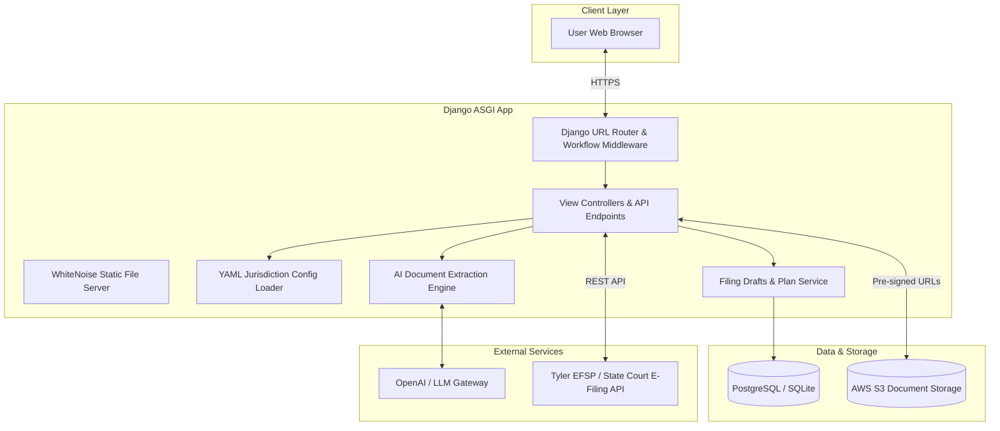

# System architecture & technologies WIP

LITEFile is designed around a clean separation of concerns between user session state, declarative jurisdiction configurations, cloud document storage, and third-party court APIs.

---

## High-level architecture diagram

---

## Core components

### 1. Application layer (`efile_app/`)
- **Django 5.2 ASGI core**: Runs using Gunicorn with Uvicorn worker threads (`uvicorn.workers.UvicornWorker`) for asynchronous performance and scalability.
- **Workflow state engine (`efile/workflow.py`)**: Manages the linear progression of the 14-step filing workflow, tracks draft state, and ensures filers cannot skip required steps.
- **Custom authentication backend (`efile/authentication.py`)**: Integrates directly with the Tyler E-Filing authentication endpoint, validating credentials against the state EFSP and creating local user profiles dynamically.

### 2. Document handling & S3 storage
- Uploaded court PDFs are validated (file format, size limits, corruption checks) and securely uploaded to AWS S3.
- All document access utilizes temporary, short-lived **Pre-Signed URLs**, ensuring buckets remain private while enabling Tyler's ingestion servers to fetch documents during envelope submission.

### 3. Declarative jurisdiction YAML system
- YAML configuration files (`static/config/states/*.yaml`) define case categories, filing types, document checklist rules, court fees, and contact info.
- Loaded into an in-memory cache on application startup, allowing court rules to change without touching application code.
