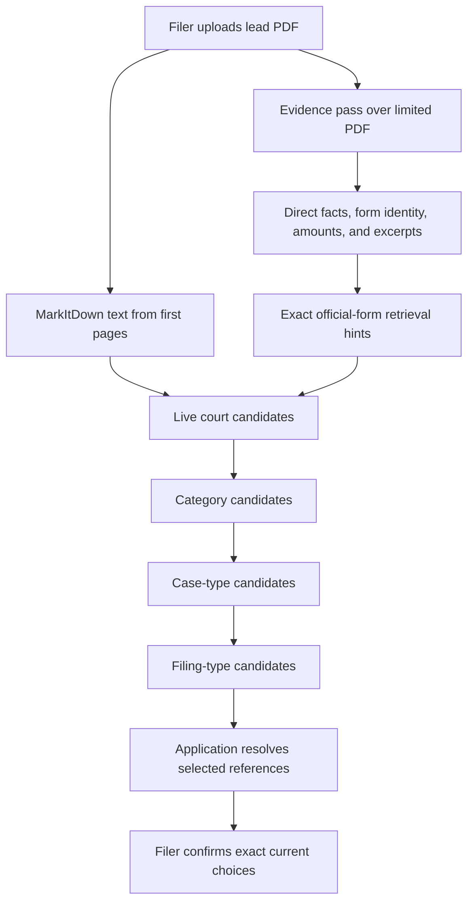

# Customizing AI document extraction & prompts <span className="wip-badge">WIP</span>

LITEFile includes a staged document-analysis engine that extracts facts from an uploaded court PDF and recommends an exact current court, case category, case type, and filing type for the filer to confirm.

This guide explains how court partners and developers can customize extraction hints, field definitions, model tiers, and private LLM gateways.

---

## How the extraction pipeline works



The extraction logic lives in:

- `efile_app/efile/prompts/document_evidence_extraction.yaml`: Direct evidence, form identity, selected options, classification excerpts, and structured monetary amounts.
- `efile_app/efile/prompts/efile_taxonomy_classification.yaml`: One-level-at-a-time selection from the current court hierarchy.
- `efile_app/efile/utils/prompt_config.py`: Prompt loading and rendering.
- `efile_app/efile/utils/llms.py`: Native inline PDF, Files API, and MarkItDown fallback calls plus model selection.
- `efile_app/efile/services/document_extractions.py`: Durable queued jobs and staged-result persistence.
- `efile_app/efile/services/taxonomy_classification.py`: Live hierarchy retrieval, exact-form hints, amount-band annotation, and application-resolved candidate references.
- `benchmarking/promptfoo/`: Prompt and model evaluation over the synthetic PDF corpus.

---

The evidence pass prefers native inline PDF input, which can preserve small
header and footer evidence for providers that support it. It records the actual
input mode and falls back to provider file IDs and then MarkItDown text. The
classification pass always receives the same first-page source text as well as
the extracted summary.

## Customizing evidence fields

The `fields` mapping in `document_evidence_extraction.yaml` defines the direct facts retained by the worker. Add fields only when a filer or a later deterministic step can use them. Do not ask this pass to invent Tyler taxonomy names.

Hints may explain court divisions, docket prefixes, and legal synonyms. They should also tell the model when to abstain. A generic motion or later filing often does not establish the underlying case type even when a docket prefix is suggestive.

---

## Customizing prompt versions

Each entry under `versions` keeps its prompt templates beside its preferred model tier, preferred models, and inference settings. Add an experimental version, run the Promptfoo matrix, and review field-level failures before changing `production_version`.

Tyler route keys vary by environment and can change. The classifier therefore sees temporary `C###` references and names, while application code resolves the selected reference to the current route key. Durable records pair that observation with the exact Tyler name and endpoint. Exact form-crosswalk mappings remain hints until a human has verified the association.

---

## LLM provider configuration and privacy

LITEFile uses an OpenAI-compatible endpoint. Provider capabilities differ, so test native PDF input and JSON output against the exact deployed model before enabling it for court documents.

### Environment variables

```bash
# OpenAI or Private Gateway
OPENAI_API_KEY="sk-..."
OPENAI_BASE_URL="https://api.openai.com/v1/"  # Or http://localhost:8000/v1/
LITEFILE_PROMPTS_DIR="/app/efile_app/efile/prompts"  # Optional deployment override
DOCUMENT_EVIDENCE_MODEL="gpt-5-nano"                 # Optional exact deployment
DOCUMENT_CLASSIFICATION_MODEL="gpt-5-mini"           # Optional exact deployment
```

### Model selection and tiers

In `llms.py`, models are arranged in three performance tiers:

- **Small (default)**: `gpt-4o-mini`, `gpt-4.1-nano`, `gemini-2.5-flash-lite`, `claude-3-5-haiku`
- **Medium**: `gpt-4o`, `gpt-4.1-mini`, `claude-3-7-sonnet`
- **Large**: `gpt-4o`, `o3`, `claude-3-7-sonnet`

The system automatically verifies model availability against the `/models` endpoint of your configured provider and falls back gracefully.
