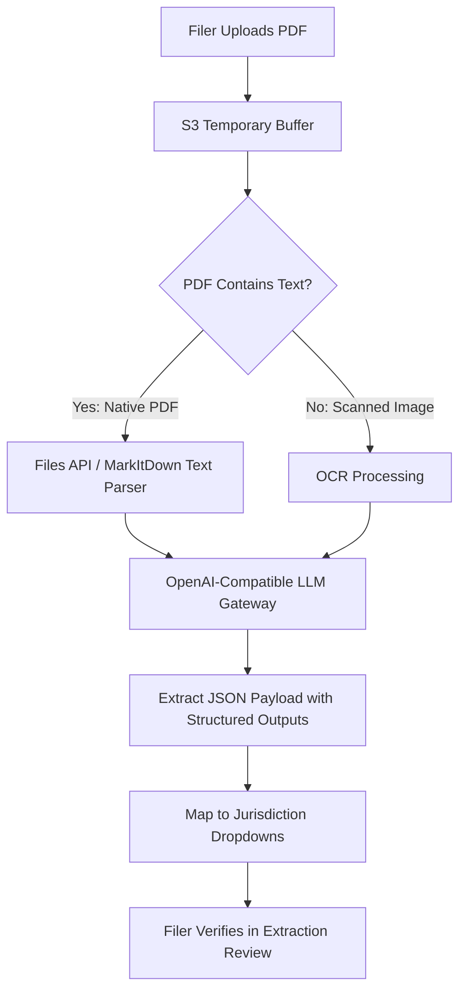

# Customizing AI document extraction & prompts <span className="wip-badge">WIP</span>

LITEFile includes an automated AI extraction engine designed to inspect uploaded court PDF documents and recommend the appropriate **Court**, **Case Category**, **Case Type**, and **Docket Number**.

This guide explains how court partners and developers can customize extraction hints, field definitions, model tiers, and private LLM gateways.

---

## 1. How the extraction pipeline works



The extraction logic lives in:
- `efile_app/efile/utils/llms.py`: Core OpenAI API wrapper, model selection, and token management.
- `efile_app/efile/views/session_api.py`: Jurisdiction-specific deduction hints (`llm_hints`) and field schemas (`llm_fields`).
- `efile_app/efile/services/document_uploads.py`: Integration with file uploads and payload guessing.

---

## 2. Customizing jurisdiction deduction hints (`llm_hints`)

In `efile_app/efile/views/session_api.py`, the `llm_hints` dictionary supplies court case classification rules to guide the LLM's reasoning:

```python
# efile_app/efile/views/session_api.py

llm_hints = {
    "illinois": """
        However you should always attempt to deduce "case_category" and "case_type", using the following information:

        * Chancery (CH): Specific Performance, Injunction, Mechanics Lien Foreclosure
        * Criminal Felony (CF) or Criminal: Petition to Expunge or Seal
        * Dissolution with Children (DC) or without Children (DN) (NOTE: Dissolution means Divorce)
        * Misdemeanor (CM)
        * Eviction (EV) NOTE: Eviction may also be called Forcible Entry and Detainer
        * Family (FA): Petition for Parentage, Visitation, or Custody
        * Guardianship (GR): Guardianship of Minor or Person with Disability
        * Law Magistrate (LM): Claims for money over $10,000 up to $50,000
        * Miscellaneous Remedy (MR): Change of Name, Administrative Review
        * Order of Protection (OP): Order of Protection, Stalking No Contact, Civil No Contact
        * Probate (PR): Administration of Decedent’s Estate
        * Small Claims (SC): Claims for money $10,000 or less
    """,
    "massachusetts": """You should always attempt to deduce "case_category" and "case_type".""",
    "vermont": """You should always attempt to deduce "case_category" and "case_type".""",
    "default": """You should always attempt to deduce "case_category" and "case_type".""",
}
```

### Adding hints for a new state:
To add or refine hints for your state, add an entry keyed by your jurisdiction identifier (e.g., `"massachusetts"` or `"california"`). Include statutory abbreviations, case code prefixes, and common legal synonyms.

---

## 3. Customizing target fields (`llm_fields`)

The `llm_fields` dictionary defines the target JSON schema and field descriptions passed to the model:

```python
# efile_app/efile/views/session_api.py

llm_fields: dict[str, dict[str, str]] = {
    "illinois": {
        "court name": "The name of the court that this form is filed in, often is the county of the court.",
        "filing type": "The formal title of the filing being made",
        "case category": "The high level category of this case",
        "case type": "The type of legal case this form is a part of",
        "docker number": "The unique identifier for this case in court. Also referred to as the case number",
    },
    "default": {
        "court name": "The name of the court that this form is filed in.",
        "filing type": "The formal title of the filing being made",
        "case category": "The high level category of this case",
        "case type": "The type of legal case this form is a part of",
        "docker number": "The unique identifier for this case in court. Also referred to as the case number",
    },
}
```

---

## 4. LLM provider configuration & privacy

LITEFile uses standard OpenAI-compatible endpoints, allowing you to use:
- **Commercial cloud models**: OpenAI (`gpt-4o-mini`, `gpt-4.1-mini`, `gpt-5-mini`), Anthropic Claude, Google Gemini.
- **Self-hosted / local LLM gateways**: vLLM, Ollama, LiteLLM proxy, or Azure OpenAI for strict court data privacy compliance.

### Environment variables:
```bash
# OpenAI or Private Gateway
OPENAI_API_KEY="sk-..."
OPENAI_BASE_URL="https://api.openai.com/v1/"  # Or http://localhost:8000/v1/
```

### Model selection & tiers:
In `llms.py`, models are arranged in three performance tiers:
- **Small (default)**: `gpt-4o-mini`, `gpt-4.1-nano`, `gemini-2.5-flash-lite`, `claude-3-5-haiku`
- **Medium**: `gpt-4o`, `gpt-4.1-mini`, `claude-3-7-sonnet`
- **Large**: `gpt-4o`, `o3`, `claude-3-7-sonnet`

The system automatically verifies model availability against the `/models` endpoint of your configured provider and falls back gracefully.
