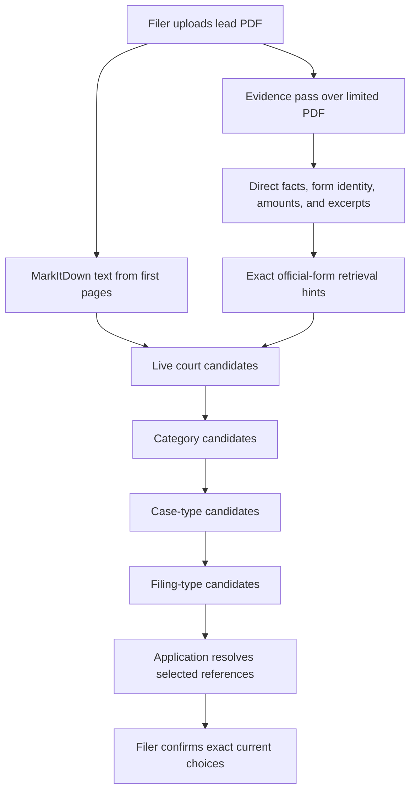

# Customizing AI document extraction & prompts <span className="wip-badge">WIP</span>

LITEFile includes a staged document-analysis engine that extracts facts from an uploaded court PDF or Word document and recommends an exact current court, case category, case type, and filing type for the filer to confirm.

This guide explains how court partners and developers can customize extraction hints, field definitions, model tiers, and private LLM gateways.

---

## How the extraction pipeline works


```mermaid
graph TD
    A[Filer uploads lead PDF] --> B[Evidence pass over limited PDF]
    B --> C[Direct facts, form identity, amounts, and excerpts]
    A --> D[MarkItDown text from first pages]
    C --> E[Exact official-form retrieval hints]
    D --> F[Live court candidates]
    E --> F
    F --> G[Category candidates]
    G --> H[Case-type candidates]
    H --> I[Filing-type candidates]
    I --> J[Application resolves selected references]
    J --> K[Filer confirms exact current choices]
```

The extraction logic lives in:

- `efile_app/efile/prompts/document_evidence_extraction.yaml`: Direct evidence, form identity, selected options, classification excerpts, and structured monetary amounts.
- `efile_app/efile/prompts/efile_taxonomy_classification.yaml`: One-level-at-a-time selection from the current court hierarchy.
- `efile_app/efile/utils/prompt_config.py`: Prompt loading and rendering.
- `efile_app/efile/utils/llms.py`: Native inline PDF, Files API, and MarkItDown fallback calls plus model selection.
- `efile_app/efile/services/document_extractions.py`: Durable queued jobs and staged-result persistence.
- `efile_app/efile/services/taxonomy_classification.py`: Live hierarchy retrieval, exact-form hints, amount-band annotation, and application-resolved candidate references.
- `benchmarking/promptfoo/`: Prompt and model evaluation over the synthetic PDF corpus.

---

The evidence pass prefers native inline PDF input, which can preserve small
header and footer evidence for providers that support it. It records the actual
input mode and falls back to provider file IDs and then MarkItDown text. The
classification pass always receives the same first-page source text as well as
the extracted summary.

## Customizing evidence fields

The `fields` mapping in `document_evidence_extraction.yaml` defines the direct facts retained by the worker. Add fields only when a filer or a later deterministic step can use them. Do not ask this pass to invent Tyler taxonomy names.

Hints may explain court divisions, docket prefixes, and legal synonyms. They should also tell the model when to abstain. A generic motion or later filing often does not establish the underlying case type even when a docket prefix is suggestive.

---

## Customizing prompt versions

Each entry under `versions` keeps its prompt templates beside its preferred model tier, preferred models, and inference settings. Add an experimental version, run the Promptfoo matrix, and review field-level failures before changing `production_version`.

Tyler route keys vary by environment and can change. The classifier therefore sees temporary `C###` references and names, while application code resolves the selected reference to the current route key. Durable records pair that observation with the exact Tyler name and endpoint. Exact form-crosswalk mappings remain hints until a human has verified the association.

---

## LLM provider configuration and privacy

LITEFile uses an OpenAI-compatible endpoint. Provider capabilities differ, so test native PDF input and JSON output against the exact deployed model before enabling it for court documents.

### Environment variables

```bash
# OpenAI or Private Gateway
OPENAI_API_KEY="sk-..."
OPENAI_BASE_URL="https://api.openai.com/v1/"  # Or http://localhost:8000/v1/
LITEFILE_PROMPTS_DIR="/app/efile_app/efile/prompts"  # Optional deployment override
DOCUMENT_EVIDENCE_MODEL="gpt-6-luna"                 # Optional exact deployment
DOCUMENT_CLASSIFICATION_MODEL="gpt-6-sol"            # Optional exact deployment
```

---

## Supported AI models and enterprise providers

*Last updated: September 2026 (subject to periodic updates for security, quality, and performance).*

LITEFile connects exclusively to enterprise-tier endpoints operating under commercial privacy agreements. User documents, extracted evidence, and case data are **never** used to train, retrain, or improve any public or private artificial intelligence models.

### Currently supported enterprise models and tiers

In `efile/utils/llms.py`, each tier is a model plus a reasoning effort. LITEFile checks the provider's `/models` endpoint and uses the first model in the tier that is deployed:

| Tier | Default model | Reasoning effort | Fallbacks | Primary purpose |
| :--- | :--- | :--- | :--- | :--- |
| **Small (default)** | `gpt-6-luna` | `none` | `gpt-5.4-nano`, `gpt-5-nano` | Fast fact extraction, caption reading, and single-level category selection |
| **Medium** | `gpt-6-sol` | `low` | `gpt-5.4-mini`, `gpt-5-mini` | Complex multi-party caption extraction and ambiguous case-type matching |
| **Large** | `gpt-6-sol` | `medium` | `gpt-5.4`, `gpt-5` | Advanced edge-case classification and unstructured document review |

On an endpoint without GPT models, such as Bedrock, Vertex, or another OpenAI-compatible gateway, each tier falls back to named Claude and Gemini models (`claude-haiku-4-5` / `claude-sonnet-5-5` / `claude-opus-5-5`, `gemini-2.5-flash-lite` / `gemini-2.5-flash` / `gemini-2.5-pro`). If none of those are listed, LITEFile picks a listed model whose name fits the tier (`haiku`, `sonnet`, `opus`, `flash`, `pro`, `mini`, `nano`, and so on), then any listed chat model, and logs a warning. To choose exactly, set `DOCUMENT_EVIDENCE_MODEL` and `DOCUMENT_CLASSIFICATION_MODEL`, or the `open ai` config.

A prompt version can set its own `inference.reasoning_effort`, and a deployment can set one for every call with the `open ai` → `reasoning effort` config. LITEFile translates the effort to what the model accepts: GPT-6 takes `none` but not `minimal`, and the original GPT-5 models take `minimal` but not `none`. Reasoning models don't accept a custom `temperature`, so LITEFile doesn't send one.

### Approved enterprise provider configurations

LITEFile deployments can route requests through any of the following enterprise configurations:

1. **Enterprise OpenAI / Azure OpenAI Service**: Commercial enterprise tier with zero data retention (ZDR) or ephemeral operational processing, and explicit no-training clauses.
2. **Private enterprise gateways**: Custom OpenAI-compatible proxy gateways (such as LiteLLM, vLLM, or court-hosted infrastructure) enforcing local jurisdictional encryption and data-residency boundaries.
3. **Vertex AI / AWS Bedrock endpoints**: Enterprise cloud platforms compliant with FedRAMP, HIPAA, SOC 2 Type II, and state court data requirements.

### Quality monitoring and human evaluation

Approved LITEFile staff may monitor AI performance manually from time to time to evaluate system accuracy, benchmark prompts, and improve the tool. Any manual review is conducted under strict confidentiality and access controls by authorized personnel, and documents are never used to train third-party AI models.

