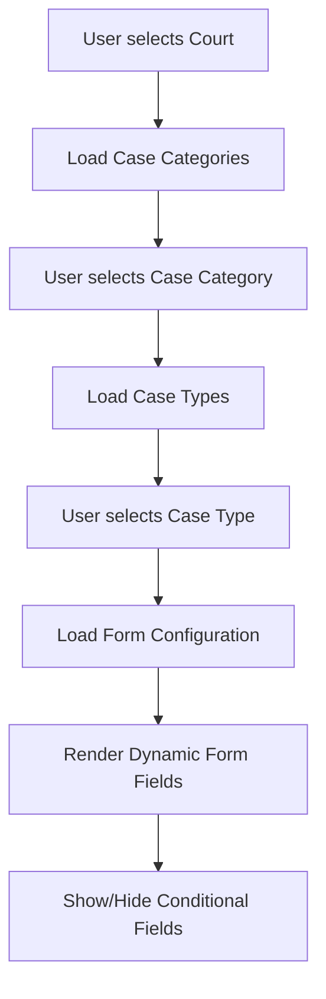

# Dynamic case form configuration system

This document explains how the Illinois eFile system uses YAML-based configuration files to dynamically generate form fields and control the cascading dropdown behavior in the expert form.

## Table of Contents

1. [System overview](#system-overview)
2. [Configuration files](#configuration-files)
3. [How it works](#how-it-works)
4. [Api integration](#api-integration)
5. [Javascript integration](#javascript-integration)
6. [Adding new case types](#adding-new-case-types)
7. [Court-specific customizations](#court-specific-customizations)
8. [Document checklists](#document-checklists)
9. [Examples](#examples)

## System overview

The configuration system provides a flexible, jurisdiction-aware approach to form generation that:

- 🏛️ **Supports multiple jurisdictions** (Illinois, Massachusetts, etc.)
- 🔄 **Inherits and extends** base configurations with state-specific overrides
- 🏛️ **Court-specific customizations** allow different fields per court
- 📋 **Dynamic form generation** creates forms based on dropdown selections
- 🔗 **Cascading dependencies** enable progressive form revelation

```
User Selections → API Calls → YAML Config → Dynamic Form Fields → JavaScript Rendering
```

## Configuration files

### File structure

```
efile/static/config/
├── README.md                    # This documentation
├── base-case-types.yaml         # Base configuration (all jurisdictions)
└── states/
    ├── illinois.yaml            # Everything specific to Illinois
    ├── massachusetts.yaml       # Everything specific to Massachusetts
    └── vermont.yaml             # Everything specific to Vermont
```

A state file is named for its jurisdiction and nothing else — `illinois.yaml`,
not `illinois-case-types.yaml` — because it holds everything that is specific to
that state, and that list grows: case types, document checklists, court
overrides, and jurisdiction display settings such as the navigation title and
logo all live in the one file.

### Configuration file hierarchy

1. **Base Configuration** (`base-case-types.yaml`)
   - Defines common case types and field structures
   - Provides default field types and validation rules
   - Acts as a template for state-specific extensions
   - Carries **no** document checklists — see below

2. **State Configuration** (`states/{jurisdiction}.yaml`)
   - Inherits from base configuration
   - Adds state-specific case types
   - Overrides field requirements, labels, and validation
   - Defines court-specific customizations
   - Holds the document checklists, which are always state-specific

3. **Runtime Merging**
   - Base + State configurations are merged at runtime
   - State configurations override base when conflicts exist
   - Court-specific rules further customize the merged configuration

## How it works

### 1. User interaction flow



### 2. Configuration loading process

#### Step 1: Dropdown Selection
When a user makes selections in the cascading dropdowns:
```javascript
// cascading-dropdowns.js
handleDropdownChange(dropdown) {
  // Triggers API call to get next dropdown options
  // Eventually calls form configuration API
}
```

#### Step 2: API Processing
The API processes the selection:
```python
# api/config_views.py
def get_form_config(request):
    case_type_id = request.GET.get('case_type')
    jurisdiction = request.session.get('jurisdiction', 'illinois')
    
    # Load and merge configurations
    case_config = CaseFormAPIViews._find_case_type_config(case_type_id, jurisdiction)
```

#### Step 3: Configuration merging
```python
# api/case_form_views.py
def _load_jurisdiction_configuration(jurisdiction='illinois'):
    base_config = _load_base_configuration()        # Load base-case-types.yaml
    jurisdiction_config = load_state_config()       # Load states/{jurisdiction}.yaml
    return _deep_merge_configs(base_config, jurisdiction_config)
```

#### Step 4: Court-Specific Customization
```python
# Apply court-specific modifications
sections = _apply_court_specific_config(sections, court_code, case_type_key, jurisdiction)
```

#### Step 5: Form Rendering
The merged configuration is returned as JSON and rendered by JavaScript.

## Api integration

### Key Api endpoints

1. **Form Configuration**: `/api/form-config/`
   ```
   GET /api/form-config/?case_type=name_change&court=cook:cd1&jurisdiction=illinois
   ```

2. **Dropdown Data**: 
   - `/api/dropdowns/courts/`
   - `/api/dropdowns/case-categories/`
   - `/api/dropdowns/case-types/`
   - `/api/dropdowns/filing-types/`

3. **Party Types**: `/api/dropdowns/party-types/`

### Api response structure

```json
{
  "success": true,
  "data": {
    "sections": {
      "parties": {
        "title": "Required Parties",
        "fields": [
          {
            "section_title": "Petitioner",
            "required": true,
            "fields": [
              {
                "name": "petitioner_party_type",
                "label": "Party Type",
                "type": "party_type_dropdown",
                "required": true,
                "api_endpoint": "/api/dropdowns/party-types/"
              }
            ]
          }
        ]
      }
    },
    "is_name_change": true,
    "jurisdiction": "illinois"
  }
}
```

## Javascript integration

### Core components

1. **CascadingDropdowns** (`cascading-dropdowns.js`)
   - Handles dropdown interactions
   - Makes API calls based on selections
   - Triggers form field generation

2. **Dynamic Form Generation**
   - Parses configuration JSON
   - Creates HTML form elements
   - Applies conditional field logic

### Key Javascript methods

```javascript
class CascadingDropdowns {
  async handleDropdownChange(dropdown) {
    // Process selection and update dependent dropdowns
  }
  
  async loadFormConfiguration() {
    // Fetch configuration from API
    // Generate dynamic form fields
  }
  
  generateFormFields(config) {
    // Convert configuration to HTML
  }
}
```

## Adding new case types

### 1. Add to Base Configuration

**File**: `base-case-types.yaml`

```yaml
base_case_types:
  new_case_type:  # Example: additional case type
    keywords: ["keyword1", "keyword2", "keyword3"]
    description: "Description of the new case type"
    sections:
      parties:
        title: "Required Parties"
        fields:
          - section_title: "Petitioner"
            required: true
            fields:
              - name: "petitioner_party_type"
                label: "Party Type"
                type: "party_type_dropdown"
                required: true
                column_width: "col-12"
```

### 2. Add State-Specific Overrides

**File**: `states/illinois.yaml`

```yaml
case_types:
  new_case_type:
    extends: "base_case_types.new_case_type"
    
    # Illinois-specific additions
    validation_rules:
      - field: "field_name"
        rule: "required"
        message: "This field is required in Illinois"
```

### 3. Add Court-Specific Rules

```yaml
court_specific_requirements:
  "court:code":  # Specific court identifier
    case_types:
      new_case_type:
        field_modifications:
          - field_group: "Section Name"
            modifications:
              conditional_requirements:
                required_for_courts: ["court:code"]
```

## Court-specific customizations

### Use cases

1. **Field Requirements**: Some courts require additional fields
2. **Field Hiding**: Some courts don't need certain sections
3. **Validation Rules**: Different courts have different requirements
4. **Terminology**: Court-specific labels and text

### Example: Cook County vs Bond Court Configuration

```yaml
court_specific_requirements:
  "cook:cd1":  # Cook County Circuit Court - County Division
    case_types:
      name_change:
        # Make both sections required for Cook County
        field_modifications:
          - field_group: "Petitioner"
            modifications:
              conditional_requirements:
                required_for_courts: ["cook:cd1"]
          - field_group: "Name Sought"
            modifications:
              conditional_requirements:
                required_for_courts: ["cook:cd1"]

  "bond":  # Bond Court
    case_types:
      name_change:
        # Hide both sections for Bond Court
        field_modifications:
          - field_group: "Petitioner"
            modifications:
              conditional_requirements:
                hidden_for_courts: ["bond"]
          - field_group: "Name Sought"
            modifications:
              conditional_requirements:
                hidden_for_courts: ["bond"]
```

**Result:**
- **Cook County (cook:cd1)**: Both Petitioner and Name Sought sections are visible and required
- **Bond Court (bond)**: Both sections are hidden, and "Required Parties" header is automatically hidden
- **Other courts**: Petitioner shows by default, Name Sought hidden by default (unless configured otherwise)

## Document checklists

A checklist tells the filer which documents a case like theirs usually needs. It
is guidance shown on the "Check your documents" screen, not validation: nothing
in a checklist blocks a submission.

### Checklists belong to a state

Every checklist key — `matches`, `documents`, `about`, `filer_roles` — is
configured in `states/{jurisdiction}.yaml`, never in `base-case-types.yaml`.
A name change needs a publication notice in Illinois and does not in most other
states, and the courts of two states rarely call the same document, case type,
or filing type by the same name. There is no useful national default to inherit,
so a state that has not been configured yet simply shows no checklist rather
than another state's list. `base-case-types.yaml` still supplies the shared
*form* structure that a state case type `extends`.

### Names, never codes

Checklist configuration identifies a case category, case type, or filing type by
the **name** the court's e-filing service returns. Tyler's numeric codes are
still fetched live and used for the actual filing, but they never appear here:
each court numbers the same concept differently, and the numbers change without
notice. When a court renames something, add the new name — nothing else changes.

```yaml
case_types:
  name_change:
    extends: "base_case_types.name_change"
    matches:
      names:
        - "Name Change"          # Cook County, County Division
        - "Change of Name"       # every other circuit checked
      aliases:
        - "Petition - Change of Name"
    documents:
      petition:
        label: "Request for name change"
        requirement: always
        role: lead
      publication_notice:
        label: "Proof that a newspaper published your notice"
        requirement: usually
        description: "A newspaper must run the notice once a week for three weeks."
```

### Requirement levels

`requirement` is one of three values, and it sets the group the item appears in:

| Value | Shown as | Means |
| --- | --- | --- |
| `always` | Always needed | The case does not go anywhere without it |
| `usually` | Usually needed | Standard for this kind of case; some cases skip it |
| `sometimes` | Sometimes needed | Only when particular facts apply |

An unknown value is logged and treated as `sometimes`.

### Matching rules

Matching is deterministic, never fuzzy. Names are normalized first — case,
runs of whitespace, and the difference between a hyphen, an en dash, and an em
dash — and then compared exactly. Cook County spells one dissolution case type
with a dash and its pair with a hyphen, so that normalizing matters; anything
beyond it does not, and guessing at legal guidance is not worth the risk.

Resolution order:

1. the case type whose `matches` include the court's case type name;
2. otherwise the case category whose `matches` include the case category name;
3. otherwise no checklist at all.

A case type checklist **replaces** category guidance. The two are never merged.

### Guidance that depends on the lead document

Some items only make sense for one kind of lead filing. Add a `when` condition
naming the filing types, again by name:

```yaml
      minor_consent:
        label: "Written consent from the child"
        requirement: sometimes
        when:
          lead_filing_type_names:
            - "Request for Name Change (Minor Children)"
```

The item appears only when the lead document's filing type name matches. If the
lead filing type is not known yet, conditional items stay hidden.

### Filing types for a checklist item

A document added from the checklist has to be filed as *something*, and the
court's list of filing types runs to dozens of entries. `filing_type_names` says
what this document is called when it is filed, most preferred first:

```yaml
      proposed_order:
        label: "Proposed order for the judge to sign"
        requirement: always
        filing_type_names:
          - "Proposed Order"
          - "Order"
          - "Other Document Not Listed"   # Kane
```

The first name the court actually publishes for this case type wins, so one
entry covers courts that name the same thing differently. Nothing is guessed:
when no configured name matches, the filing type is left empty and the filer
chooses it on the organize step, exactly as before. **A wrong filing type is
worse than a blank one** — list only names that really mean this document.
Cook County, for instance, publishes no order or catch-all type for a name
change, so `proposed_order` is deliberately left unresolved there.

Only ever fills a blank: a filing type the filer picked themselves is never
overwritten.

### Explaining the list

A list of documents raises a fair question — "is this everything?" — and the
honest answer does not fit in a caption. `about` is where a case type says what
this kind of filing is, and what the list cannot know. It appears on the filer's
plan behind an "About this list" accordion, folded away so it never stands
between them and filing.

```yaml
    about:
      summary: >-
        A name change asks a judge to make your new name official. Courts differ
        about the rest, and yours may ask for something this list does not
        mention.
      learn_more_url: "https://www.illinoislegalaid.org/legal-information/changing-your-name"
      learn_more_label: "Changing your name in Illinois (Illinois Legal Aid Online)"
```

- `learn_more_url` must be an `http://` or `https://` address; anything else is
  logged and dropped. The link opens in a new tab.
- Both fields are optional, and most case types will have neither.
- `by_role` works here too, so each side of a two-sided case gets its own
  explanation and its own place to read more.

A standing sentence about the list being a guide rather than legal advice is
always shown underneath, whatever a partner writes, so the caveat cannot be
configured away.

### Cases with two sides

In a two-sided case, one case type means two different jobs. The landlord in an
eviction files a complaint; the tenant files an appearance and an answer, and
needs the same fee waiver described in the opposite direction. A case type that
declares `filer_roles` is asked about on the confirm-filing screen — "Which side
of this case are you on?" — and every list below it is that side's list, in that
side's words.

```yaml
    filer_roles:
      landlord:
        label: "The landlord, or someone filing for the landlord"
        description: "You are asking the court to end a tenancy."
        # Matched against the party-type names the court publishes, to suggest
        # the filer's own party type later. Codes are never named here.
        party_type_keywords: ["plaintiff", "petitioner"]
        # Marks a side as the likely one, for the filer to confirm. It is never
        # chosen for them: which side you are on is a legal fact about you.
        suggested_when:
          lead_filing_type_names: ["Complaint", "Eviction Complaint"]
      tenant:
        label: "The tenant"
        party_type_keywords: ["defendant", "respondent"]
    documents:
      complaint:
        label: "Eviction complaint"
        requirement: always
        role: lead
        for_roles: ["landlord"]      # the other side never sees this item
      proof_of_service:
        label: "Proof that the other side got a copy"
        requirement: usually
        by_role:                     # one requirement, two sentences
          landlord:
            label: "Proof that the tenant got the court papers"
            description: "The sheriff or a special process server files this."
          tenant:
            label: "Proof that the landlord got a copy"
            requirement: always
```

- `for_roles` limits an item to the sides listed. An item without it belongs to
  everyone, including cases that declare no sides at all.
- `by_role` rewrites `label`, `description`, and `requirement` for one side.
  Nothing else can be overridden: a side may hear about the same document in its
  own words, but must not be handed a different document under an ID the other
  side uses for something else.
- A case type that declares `filer_roles` has **no** checklist until the filer
  picks a side. Half a list is worse than none: the other half belongs to the
  party on the other side of the case.

Most case types have no sides, and should not declare any. Asking a name-change
filer which side they are on is noise.

### Court-specific checklists

`documents` is a dictionary keyed by your own IDs, and court overrides deep
merge into it, so a court can change one item, add a local form, or drop an
inherited item without restating the list:

```yaml
court_specific_requirements:
  "cook:cd1":
    case_types:
      name_change:
        documents:
          publication_notice:
            requirement: always      # change one field of an inherited item
          county_division_cover_sheet:
            label: "County Division information sheet"
            requirement: always      # add a local form
          fee_waiver:
            include: false           # drop an inherited item
```

### Category-level guidance

Broad guidance for cases whose case type nobody has configured yet:

```yaml
case_categories:
  small_claims:
    matches:
      names:
        - "Small Claims"
    documents:
      supporting_records:
        label: "Papers that back up your side"
        requirement: usually
```

### What the filer sees

The resolved checklist and `about` block are copied into the filer's
`FilingPlan` — their matter — the first time they reach the checklist screen.
Because it is a snapshot, editing this YAML later changes what **new** plans get
and leaves plans people are already working through alone.

Against each item the filer records where they are with it: nothing yet, *I have
it now*, *I already filed this*, or *I will file it later* with an optional date.
Only the first two count as sorted out. A document they have but have not
attached is what the review step warns about; one they have already filed, or
have deliberately left for later, is not a gap and is not raised again.

## Examples

### Name change configuration

**Base Configuration** (`base-case-types.yaml`):
```yaml
base_case_types:
  name_change:
    keywords: ["name change", "name petition", "change of name"]
    description: "Legal name change proceedings"
    sections:
      parties:
        title: "Required Parties"
        api_endpoint: "/api/dropdowns/party-types/"
        requires_params: ["court", "case_type"]
        fields:
          - section_title: "Petitioner"
            required: true
            fields:
              - name: "petitioner_party_type"
                label: "Party Type"
                type: "party_type_dropdown"
                required: true
                column_width: "col-12"
                api_endpoint: "/api/dropdowns/party-types/"
              - name: "petitioner_first_name"
                label: "First Name"
                type: "text"
                required: true
                column_width: "col-6"
              - name: "petitioner_last_name"
                label: "Last Name"
                type: "text"
                required: true
                column_width: "col-6"
          - section_title: "Name Sought"
            required: false  # Can be made required by court-specific rules
            fields:
              - name: "new_name_party_type"
                label: "Party Type"
                type: "party_type_dropdown"
                required: true
                column_width: "col-12"
                api_endpoint: "/api/dropdowns/party-types/"
              - name: "new_first_name"
                label: "First Name"
                type: "text"
                required: true
                column_width: "col-6"
              - name: "new_last_name"
                label: "Last Name"
                type: "text"
                required: true
                column_width: "col-6"
```

**Illinois Override** (`states/illinois.yaml`):
```yaml
case_types:
  name_change:
    extends: "base_case_types.name_change"
    validation_rules:
      - field: "petitioner_first_name"
        rule: "no_special_chars"
        message: "First name cannot contain special characters"
      - field: "new_last_name" 
        rule: "max_length"
        value: 50
        message: "Last name cannot exceed 50 characters"
```

**Court-Specific Rule**:
```yaml
court_specific_requirements:
  "cook:cd1":  # Cook County Circuit Court - County Division
    case_types:
      name_change:
        # Make "Name Sought" section required for Cook County CD1
        field_modifications:
          - field_group: "Name Sought"
            modifications:
              conditional_requirements:
                required_for_courts: ["cook:cd1"]
```

### Result

When a user selects:
- Court: Cook County Circuit Court - County Division
- Case Type: Name Change

The system generates a form with:
- Base fields (first name, last name)
- Illinois validation (no special characters)
- Cook County requirement (Name Sought section becomes required)

## Configuration schema reference

### Supported Case Types

Currently supported case type:

**Name Change** (`name_change`)
- Keywords: "name change", "name petition", "change of name"
- Sections: Petitioner (always required), Name Sought (court-dependent)
- Illinois-specific validation rules implemented
- Cook County-specific requirements supported

**Note**: Other case types (divorce, order of protection, eviction/repossession) are defined in the YAML files but not currently active in the production system.

### Court-based conditional logic

The system implements court-based conditional requirements for fine-grained control over section visibility:

```yaml
conditional_requirements:
  required_for_courts: ["cook:cd1"]     # Required only for these courts
  hidden_for_courts: ["bond_court"]     # Hidden for these courts  
  optional_for_courts: ["dupage:cd1"]   # Optional for these courts
  required_for_counties: ["cook"]       # Required for these counties
  optional_for_counties: ["lake"]       # Optional for these counties
```

**Key Features:**
- **Section-level control**: Hide entire form sections based on court selection
- **Dynamic header management**: "Required Parties" header automatically hides when no sections are visible
- **Court code matching**: Exact court code matching (e.g., "bond" matches configuration for "bond")
- **Fallback logic**: Sections show by default unless explicitly hidden

### Field-level conditional display (Planned)

Field-level conditional display is documented but not yet fully implemented:

```yaml
# Planned feature - not yet active in JavaScript
conditional_display:
  show_when_field: "other_field"
  show_when_value: "yes"
```

This feature is planned for future implementation when additional case types are activated.

### Field types

```yaml
# Text input
- name: "field_name"
  label: "Display Label"
  type: "text"
  required: true
  column_width: "col-6"

# Dropdown
- name: "dropdown_field"
  label: "Select Option"
  type: "party_type_dropdown"
  api_endpoint: "/api/dropdowns/party-types/"

# Radio buttons
- name: "radio_field"
  type: "radio"
  options:
    - value: "yes"
      label: "Yes"
    - value: "no"
      label: "No"

# Conditional field (partially implemented - court-based logic works)
- name: "conditional_field"
  conditional_display:
    show_when_field: "other_field"  # Not yet fully implemented
    show_when_value: "yes"          # Not yet fully implemented
    
# Court-based conditional requirements (implemented)
- section_title: "Optional Section"
  conditional_requirements:
    required_for_courts: ["cook:cd1", "cook:chd1"]
    hidden_for_courts: ["dupage:cd1"]
    optional_for_counties: ["lake", "will"]
```

### Column width options

- `col-12`: Full width
- `col-6`: Half width
- `col-4`: One-third width
- `col-8`: Two-thirds width

### Validation rules

```yaml
validation_rules:
  - field: "field_name"
    rule: "required"
    message: "This field is required"
  - field: "field_name"
    rule: "max_length"
    value: 50
    message: "Cannot exceed 50 characters"
  - field: "field_name"
    rule: "no_special_chars"
    message: "No special characters allowed"
  - field: "case_number"
    rule: "pattern"
    value: "^[A-Z0-9\\-]+$"
    message: "Case number must contain only letters, numbers, and hyphens"
```

## Troubleshooting


### Keyword matching logic

The system uses intelligent keyword matching to determine which configuration to use:

#### Example keywords and matches:
```yaml
# Name change case type (currently supported)
keywords: ["name change", "name petition", "change of name"]
# Matches: "Name Change Petition", "Legal Name Change", "Petition for Change of Name"

# Future case types can follow similar patterns:
# keywords: ["case type keyword", "alternative term", "legal term"]
# Matches: Suffolk case types containing these keywords
```

#### Matching logic:
1. **Exact match**: "name change" exactly matches "name change"
2. **Substring (keyword in case type)**: "name change" matches "Name Change Petition"  
3. **Substring (case type in keyword)**: "change of name" matches "Legal Name Change"

### Debug tips

1. **Check browser console** for JavaScript errors
2. **Inspect API responses** in browser developer tools
3. **Verify YAML syntax** using online validators
4. **Check Django logs** for configuration loading errors

### Testing configuration changes

1. Restart Django server to reload YAML files
2. Clear browser cache to refresh JavaScript
3. Test with different court and case type combinations
4. Verify field visibility and requirements work as expected

## Current implementation status

### ✅ Fully implemented features
- **Base case type inheritance**: States extend base configurations
- **Court-specific conditional requirements**: Fields can be required/hidden based on court selection
- **Dynamic form generation**: YAML configurations converted to HTML forms
- **Cascading dropdowns**: Court → Case Category → Case Type workflow
- **Party type dropdowns**: Dynamic loading based on court and case type
- **Validation rules**: Field-level validation with custom messages
- **Keyword matching**: Intelligent matching of Suffolk case types to configurations
- **Dynamic section visibility**: Sections and headers automatically hide when no content is rendered
- **Court-specific field modifications**: Granular control over field visibility per court

### ⚠️ Partially implemented features  
- **Field-level conditional display**: Structure documented but JavaScript implementation pending
  - `show_when_field`/`show_when_value` logic not yet active
  - Massachusetts config shows intended structure
  - Court-based conditional logic works as alternative

### 📋 Configuration coverage
- **Name Change**: ✅ Base + Illinois implementation with court-specific variations
  - Cook County: Both sections required and visible
  - Bond Court: Both sections hidden (demonstrates section hiding functionality)
  - Other courts: Petitioner visible, Name Sought hidden by default
- **Other Case Types**: ⚠️ Defined in YAML files but not active in production system

### 🔧 Development notes
- **Field conditional display**: Requires JavaScript enhancement in `dynamic-form-sections.js` when additional case types are implemented
- **Additional case types**: Available in YAML but not enabled for production use
- **Court customizations**: Working system demonstrated with Cook County name change variations

### To-Do's
- **Changing sections to array data structure**: Consider making changes to how we injest sections and instead of using keys can possibly use arrays for more flexible dyanmic sections. 