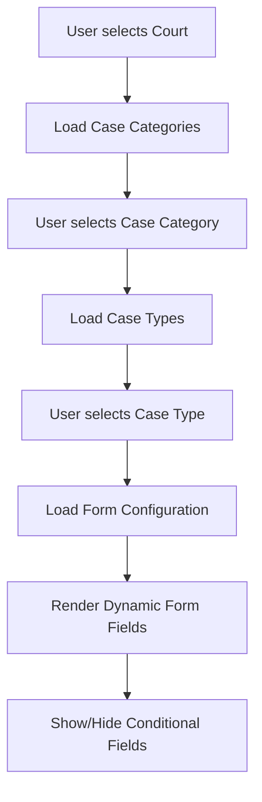

# Dynamic Case Form Configuration System

This document explains how the Illinois eFile system uses YAML-based configuration files to dynamically generate form fields and control the cascading dropdown behavior in the expert form.

## Table of Contents

1. [System Overview](#system-overview)
2. [Configuration Files](#configuration-files)
3. [How It Works](#how-it-works)
4. [API Integration](#api-integration)
5. [JavaScript Integration](#javascript-integration)
6. [Adding New Case Types](#adding-new-case-types)
7. [Court-Specific Customizations](#court-specific-customizations)
8. [Examples](#examples)

## System Overview

The configuration system provides a flexible, jurisdiction-aware approach to form generation that:

- 🏛️ **Supports multiple jurisdictions** (Illinois, Massachusetts, etc.)
- 🔄 **Inherits and extends** base configurations with state-specific overrides
- 🏛️ **Court-specific customizations** allow different fields per court
- 📋 **Dynamic form generation** creates forms based on dropdown selections
- 🔗 **Cascading dependencies** enable progressive form revelation

```
User Selections → API Calls → YAML Config → Dynamic Form Fields → JavaScript Rendering
```

## Configuration Files

### File Structure

```
efile/static/config/
├── README.md                    # This documentation
├── base-case-types.yaml         # Base configuration (all jurisdictions)
└── states/
    ├── illinois.yaml            # Illinois-specific overrides
    └── massachusetts.yaml       # Massachusetts-specific overrides
```

### Configuration Hierarchy

1. **Base Configuration** (`base-case-types.yaml`)
   - Defines common case types and field structures
   - Provides default field types and validation rules
   - Acts as a template for state-specific extensions

2. **State Configuration** (`states/{jurisdiction}.yaml`)
   - Inherits from base configuration
   - Adds state-specific case types
   - Overrides field requirements, labels, and validation
   - Defines court-specific customizations

3. **Runtime Merging**
   - Base + State configurations are merged at runtime
   - State configurations override base when conflicts exist
   - Court-specific rules further customize the merged configuration

## How It Works

### 1. User Interaction Flow



### 2. Configuration Loading Process

#### Step 1: Dropdown Selection
When a user makes selections in the cascading dropdowns:
```javascript
// cascading-dropdowns.js
handleDropdownChange(dropdown) {
  // Triggers API call to get next dropdown options
  // Eventually calls form configuration API
}
```

#### Step 2: API Processing
The API processes the selection:
```python
# api/config_views.py
def get_form_config(request):
    case_type_id = request.GET.get('case_type')
    jurisdiction = request.session.get('jurisdiction', 'illinois')
    
    # Load and merge configurations
    case_config = CaseFormAPIViews._find_case_type_config(case_type_id, jurisdiction)
```

#### Step 3: Configuration Merging
```python
# api/case_form_views.py
def _load_jurisdiction_configuration(jurisdiction='illinois'):
    base_config = _load_base_configuration()        # Load base-case-types.yaml
    jurisdiction_config = load_state_config()       # Load states/{jurisdiction}.yaml
    return _deep_merge_configs(base_config, jurisdiction_config)
```

#### Step 4: Court-Specific Customization
```python
# Apply court-specific modifications
sections = _apply_court_specific_config(sections, court_code, case_type_key, jurisdiction)
```

#### Step 5: Form Rendering
The merged configuration is returned as JSON and rendered by JavaScript.

## API Integration

### Key API Endpoints

1. **Form Configuration**: `/api/form-config/`
   ```
   GET /api/form-config/?case_type=name_change&court=cook:cd1&jurisdiction=illinois
   ```

2. **Dropdown Data**: 
   - `/api/dropdowns/courts/`
   - `/api/dropdowns/case-categories/`
   - `/api/dropdowns/case-types/`
   - `/api/dropdowns/filing-types/`

3. **Party Types**: `/api/dropdowns/party-types/`

### API Response Structure

```json
{
  "success": true,
  "data": {
    "sections": {
      "parties": {
        "title": "Required Parties",
        "fields": [
          {
            "section_title": "Petitioner",
            "required": true,
            "fields": [
              {
                "name": "petitioner_party_type",
                "label": "Party Type",
                "type": "party_type_dropdown",
                "required": true,
                "api_endpoint": "/api/dropdowns/party-types/"
              }
            ]
          }
        ]
      }
    },
    "is_name_change": true,
    "jurisdiction": "illinois"
  }
}
```

## JavaScript Integration

### Core Components

1. **CascadingDropdowns** (`cascading-dropdowns.js`)
   - Handles dropdown interactions
   - Makes API calls based on selections
   - Triggers form field generation

2. **Dynamic Form Generation**
   - Parses configuration JSON
   - Creates HTML form elements
   - Applies conditional field logic

### Key JavaScript Methods

```javascript
class CascadingDropdowns {
  async handleDropdownChange(dropdown) {
    // Process selection and update dependent dropdowns
  }
  
  async loadFormConfiguration() {
    // Fetch configuration from API
    // Generate dynamic form fields
  }
  
  generateFormFields(config) {
    // Convert configuration to HTML
  }
}
```

## Adding New Case Types

### 1. Add to Base Configuration

**File**: `base-case-types.yaml`

```yaml
base_case_types:
  new_case_type:  # Example: additional case type
    keywords: ["keyword1", "keyword2", "keyword3"]
    description: "Description of the new case type"
    sections:
      parties:
        title: "Required Parties"
        fields:
          - section_title: "Petitioner"
            required: true
            fields:
              - name: "petitioner_party_type"
                label: "Party Type"
                type: "party_type_dropdown"
                required: true
                column_width: "col-12"
```

### 2. Add State-Specific Overrides

**File**: `states/illinois.yaml`

```yaml
case_types:
  new_case_type:
    extends: "base_case_types.new_case_type"
    
    # Illinois-specific additions
    validation_rules:
      - field: "field_name"
        rule: "required"
        message: "This field is required in Illinois"
```

### 3. Add Court-Specific Rules

```yaml
court_specific_requirements:
  "court:code":  # Specific court identifier
    case_types:
      new_case_type:
        field_modifications:
          - field_group: "Section Name"
            modifications:
              conditional_requirements:
                required_for_courts: ["court:code"]
```

## Court-Specific Customizations

### Use Cases

1. **Field Requirements**: Some courts require additional fields
2. **Field Hiding**: Some courts don't need certain sections
3. **Validation Rules**: Different courts have different requirements
4. **Terminology**: Court-specific labels and text

### Example: Cook County vs Bond Court Configuration

```yaml
court_specific_requirements:
  "cook:cd1":  # Cook County Circuit Court - County Division
    case_types:
      name_change:
        # Make both sections required for Cook County
        field_modifications:
          - field_group: "Petitioner"
            modifications:
              conditional_requirements:
                required_for_courts: ["cook:cd1"]
          - field_group: "Name Sought"
            modifications:
              conditional_requirements:
                required_for_courts: ["cook:cd1"]

  "bond":  # Bond Court
    case_types:
      name_change:
        # Hide both sections for Bond Court
        field_modifications:
          - field_group: "Petitioner"
            modifications:
              conditional_requirements:
                hidden_for_courts: ["bond"]
          - field_group: "Name Sought"
            modifications:
              conditional_requirements:
                hidden_for_courts: ["bond"]
```

**Result:**
- **Cook County (cook:cd1)**: Both Petitioner and Name Sought sections are visible and required
- **Bond Court (bond)**: Both sections are hidden, and "Required Parties" header is automatically hidden
- **Other courts**: Petitioner shows by default, Name Sought hidden by default (unless configured otherwise)

## Examples

### Name Change Configuration

**Base Configuration** (`base-case-types.yaml`):
```yaml
base_case_types:
  name_change:
    keywords: ["name change", "name petition", "change of name"]
    description: "Legal name change proceedings"
    sections:
      parties:
        title: "Required Parties"
        api_endpoint: "/api/dropdowns/party-types/"
        requires_params: ["court", "case_type"]
        fields:
          - section_title: "Petitioner"
            required: true
            fields:
              - name: "petitioner_party_type"
                label: "Party Type"
                type: "party_type_dropdown"
                required: true
                column_width: "col-12"
                api_endpoint: "/api/dropdowns/party-types/"
              - name: "petitioner_first_name"
                label: "First Name"
                type: "text"
                required: true
                column_width: "col-6"
              - name: "petitioner_last_name"
                label: "Last Name"
                type: "text"
                required: true
                column_width: "col-6"
          - section_title: "Name Sought"
            required: false  # Can be made required by court-specific rules
            fields:
              - name: "new_name_party_type"
                label: "Party Type"
                type: "party_type_dropdown"
                required: true
                column_width: "col-12"
                api_endpoint: "/api/dropdowns/party-types/"
              - name: "new_first_name"
                label: "First Name"
                type: "text"
                required: true
                column_width: "col-6"
              - name: "new_last_name"
                label: "Last Name"
                type: "text"
                required: true
                column_width: "col-6"
```

**Illinois Override** (`states/illinois.yaml`):
```yaml
case_types:
  name_change:
    extends: "base_case_types.name_change"
    validation_rules:
      - field: "petitioner_first_name"
        rule: "no_special_chars"
        message: "First name cannot contain special characters"
      - field: "new_last_name" 
        rule: "max_length"
        value: 50
        message: "Last name cannot exceed 50 characters"
```

**Court-Specific Rule**:
```yaml
court_specific_requirements:
  "cook:cd1":  # Cook County Circuit Court - County Division
    case_types:
      name_change:
        # Make "Name Sought" section required for Cook County CD1
        field_modifications:
          - field_group: "Name Sought"
            modifications:
              conditional_requirements:
                required_for_courts: ["cook:cd1"]
```

### Result

When a user selects:
- Court: Cook County Circuit Court - County Division
- Case Type: Name Change

The system generates a form with:
- Base fields (first name, last name)
- Illinois validation (no special characters)
- Cook County requirement (Name Sought section becomes required)

## Configuration Schema Reference

### Supported Case Types

Currently supported case type:

**Name Change** (`name_change`)
- Keywords: "name change", "name petition", "change of name"
- Sections: Petitioner (always required), Name Sought (court-dependent)
- Illinois-specific validation rules implemented
- Cook County-specific requirements supported

**Note**: Other case types (divorce, order of protection, eviction/repossession) are defined in the YAML files but not currently active in the production system.

### Court-Based Conditional Logic

The system implements court-based conditional requirements for fine-grained control over section visibility:

```yaml
conditional_requirements:
  required_for_courts: ["cook:cd1"]     # Required only for these courts
  hidden_for_courts: ["bond_court"]     # Hidden for these courts  
  optional_for_courts: ["dupage:cd1"]   # Optional for these courts
  required_for_counties: ["cook"]       # Required for these counties
  optional_for_counties: ["lake"]       # Optional for these counties
```

**Key Features:**
- **Section-level control**: Hide entire form sections based on court selection
- **Dynamic header management**: "Required Parties" header automatically hides when no sections are visible
- **Court code matching**: Exact court code matching (e.g., "bond" matches configuration for "bond")
- **Fallback logic**: Sections show by default unless explicitly hidden

### Field-Level Conditional Display (Planned)

Field-level conditional display is documented but not yet fully implemented:

```yaml
# Planned feature - not yet active in JavaScript
conditional_display:
  show_when_field: "other_field"
  show_when_value: "yes"
```

This feature is planned for future implementation when additional case types are activated.

### Field Types

```yaml
# Text input
- name: "field_name"
  label: "Display Label"
  type: "text"
  required: true
  column_width: "col-6"

# Dropdown
- name: "dropdown_field"
  label: "Select Option"
  type: "party_type_dropdown"
  api_endpoint: "/api/dropdowns/party-types/"

# Radio buttons
- name: "radio_field"
  type: "radio"
  options:
    - value: "yes"
      label: "Yes"
    - value: "no"
      label: "No"

# Conditional field (partially implemented - court-based logic works)
- name: "conditional_field"
  conditional_display:
    show_when_field: "other_field"  # Not yet fully implemented
    show_when_value: "yes"          # Not yet fully implemented
    
# Court-based conditional requirements (implemented)
- section_title: "Optional Section"
  conditional_requirements:
    required_for_courts: ["cook:cd1", "cook:chd1"]
    hidden_for_courts: ["dupage:cd1"]
    optional_for_counties: ["lake", "will"]
```

### Column Width Options

- `col-12`: Full width
- `col-6`: Half width
- `col-4`: One-third width
- `col-8`: Two-thirds width

### Validation Rules

```yaml
validation_rules:
  - field: "field_name"
    rule: "required"
    message: "This field is required"
  - field: "field_name"
    rule: "max_length"
    value: 50
    message: "Cannot exceed 50 characters"
  - field: "field_name"
    rule: "no_special_chars"
    message: "No special characters allowed"
  - field: "case_number"
    rule: "pattern"
    value: "^[A-Z0-9\\-]+$"
    message: "Case number must contain only letters, numbers, and hyphens"
```

## Troubleshooting


### Keyword Matching Logic

The system uses intelligent keyword matching to determine which configuration to use:

#### Example Keywords and Matches:
```yaml
# Name change case type (currently supported)
keywords: ["name change", "name petition", "change of name"]
# Matches: "Name Change Petition", "Legal Name Change", "Petition for Change of Name"

# Future case types can follow similar patterns:
# keywords: ["case type keyword", "alternative term", "legal term"]
# Matches: Suffolk case types containing these keywords
```

#### Matching Logic:
1. **Exact match**: "name change" exactly matches "name change"
2. **Substring (keyword in case type)**: "name change" matches "Name Change Petition"  
3. **Substring (case type in keyword)**: "change of name" matches "Legal Name Change"

### Debug Tips

1. **Check browser console** for JavaScript errors
2. **Inspect API responses** in browser developer tools
3. **Verify YAML syntax** using online validators
4. **Check Django logs** for configuration loading errors

### Testing Configuration Changes

1. Restart Django server to reload YAML files
2. Clear browser cache to refresh JavaScript
3. Test with different court and case type combinations
4. Verify field visibility and requirements work as expected

## Current Implementation Status

### ✅ Fully Implemented Features
- **Base case type inheritance**: States extend base configurations
- **Court-specific conditional requirements**: Fields can be required/hidden based on court selection
- **Dynamic form generation**: YAML configurations converted to HTML forms
- **Cascading dropdowns**: Court → Case Category → Case Type workflow
- **Party type dropdowns**: Dynamic loading based on court and case type
- **Validation rules**: Field-level validation with custom messages
- **Keyword matching**: Intelligent matching of Suffolk case types to configurations
- **Dynamic section visibility**: Sections and headers automatically hide when no content is rendered
- **Court-specific field modifications**: Granular control over field visibility per court

### ⚠️ Partially Implemented Features  
- **Field-level conditional display**: Structure documented but JavaScript implementation pending
  - `show_when_field`/`show_when_value` logic not yet active
  - Massachusetts config shows intended structure
  - Court-based conditional logic works as alternative

### 📋 Configuration Coverage
- **Name Change**: ✅ Base + Illinois implementation with court-specific variations
  - Cook County: Both sections required and visible
  - Bond Court: Both sections hidden (demonstrates section hiding functionality)
  - Other courts: Petitioner visible, Name Sought hidden by default
- **Other Case Types**: ⚠️ Defined in YAML files but not active in production system

### 🔧 Development Notes
- **Field conditional display**: Requires JavaScript enhancement in `dynamic-form-sections.js` when additional case types are implemented
- **Additional case types**: Available in YAML but not enabled for production use
- **Court customizations**: Working system demonstrated with Cook County name change variations

### To-Do's
- **Changing sections to array data structure**: Consider making changes to how we injest sections and instead of using keys can possibly use arrays for more flexible dyanmic sections. 