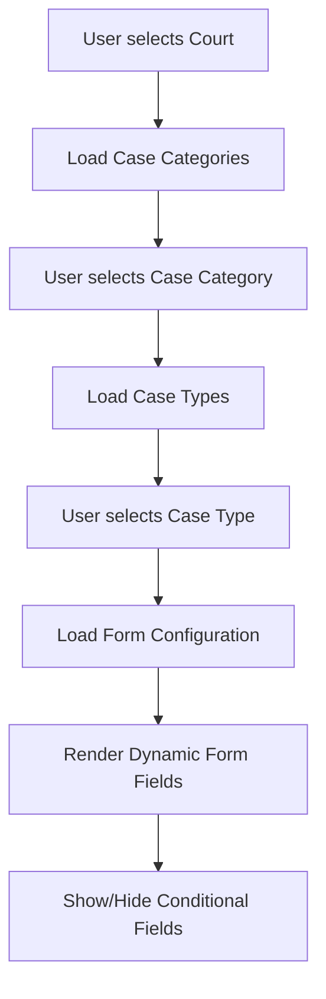

# Dynamic Case Form Configuration System

This document explains how the Illinois eFile system uses YAML-based configuration files to dynamically generate form fields and control the cascading dropdown behavior in the expert form.

## Table of Contents

1. [System Overview](#system-overview)
2. [Configuration Files](#configuration-files)
3. [How It Works](#how-it-works)
4. [API Integration](#api-integration)
5. [JavaScript Integration](#javascript-integration)
6. [Adding New Case Types](#adding-new-case-types)
7. [Court-Specific Customizations](#court-specific-customizations)
8. [Examples](#examples)

## System Overview

The configuration system provides a flexible, jurisdiction-aware approach to form generation that:

- 🏛️ **Supports multiple jurisdictions** (Illinois, Massachusetts, etc.)
- 🔄 **Inherits and extends** base configurations with state-specific overrides
- 🏛️ **Court-specific customizations** allow different fields per court
- 📋 **Dynamic form generation** creates forms based on dropdown selections
- 🔗 **Cascading dependencies** enable progressive form revelation

```
User Selections → API Calls → YAML Config → Dynamic Form Fields → JavaScript Rendering
```

## Configuration Files

### File Structure

```
efile/static/config/
├── README.md                    # This documentation
├── base-case-types.yaml         # Base configuration (all jurisdictions)
└── states/
    ├── illinois.yaml            # Illinois-specific overrides
    └── massachusetts.yaml       # Massachusetts-specific overrides
```

### Configuration Hierarchy

1. **Base Configuration** (`base-case-types.yaml`)
   - Defines common case types and field structures
   - Provides default field types and validation rules
   - Acts as a template for state-specific extensions

2. **State Configuration** (`states/{jurisdiction}.yaml`)
   - Inherits from base configuration
   - Adds state-specific case types
   - Overrides field requirements, labels, and validation
   - Defines court-specific customizations

3. **Runtime Merging**
   - Base + State configurations are merged at runtime
   - State configurations override base when conflicts exist
   - Court-specific rules further customize the merged configuration

## How It Works

### 1. User Interaction Flow



### 2. Configuration Loading Process

#### Step 1: Dropdown Selection
When a user makes selections in the cascading dropdowns:
```javascript
// cascading-dropdowns.js
handleDropdownChange(dropdown) {
  // Triggers API call to get next dropdown options
  // Eventually calls form configuration API
}
```

#### Step 2: API Processing
The API processes the selection:
```python
# api/config_views.py
def get_form_config(request):
    case_type_id = request.GET.get('case_type')
    jurisdiction = request.session.get('jurisdiction', 'illinois')
    
    # Load and merge configurations
    case_config = CaseFormAPIViews._find_case_type_config(case_type_id, jurisdiction)
```

#### Step 3: Configuration Merging
```python
# api/case_form_views.py
def _load_jurisdiction_configuration(jurisdiction='illinois'):
    base_config = _load_base_configuration()        # Load base-case-types.yaml
    jurisdiction_config = load_state_config()       # Load states/{jurisdiction}.yaml
    return _deep_merge_configs(base_config, jurisdiction_config)
```

#### Step 4: Court-Specific Customization
```python
# Apply court-specific modifications
sections = _apply_court_specific_config(sections, court_code, case_type_key, jurisdiction)
```

#### Step 5: Form Rendering
The merged configuration is returned as JSON and rendered by JavaScript.

## API Integration

### Key API Endpoints

1. **Form Configuration**: `/api/form-config/`
   ```
   GET /api/form-config/?case_type=name_change&court=cook:cd1&jurisdiction=illinois
   ```

2. **Dropdown Data**: 
   - `/api/dropdowns/courts/`
   - `/api/dropdowns/case-categories/`
   - `/api/dropdowns/case-types/`
   - `/api/dropdowns/filing-types/`

3. **Party Types**: `/api/dropdowns/party-types/`

### API Response Structure

```json
{
  "success": true,
  "data": {
    "sections": {
      "parties": {
        "title": "Required Parties",
        "fields": [
          {
            "section_title": "Petitioner",
            "required": true,
            "fields": [
              {
                "name": "petitioner_party_type",
                "label": "Party Type",
                "type": "party_type_dropdown",
                "required": true,
                "api_endpoint": "/api/dropdowns/party-types/"
              }
            ]
          }
        ]
      }
    },
    "is_name_change": true,
    "jurisdiction": "illinois"
  }
}
```

## JavaScript Integration

### Core Components

1. **CascadingDropdowns** (`cascading-dropdowns.js`)
   - Handles dropdown interactions
   - Makes API calls based on selections
   - Triggers form field generation

2. **Dynamic Form Generation**
   - Parses configuration JSON
   - Creates HTML form elements
   - Applies conditional field logic

### Key JavaScript Methods

```javascript
class CascadingDropdowns {
  async handleDropdownChange(dropdown) {
    // Process selection and update dependent dropdowns
  }
  
  async loadFormConfiguration() {
    // Fetch configuration from API
    // Generate dynamic form fields
  }
  
  generateFormFields(config) {
    // Convert configuration to HTML
  }
}
```

## Adding New Case Types

### 1. Add to Base Configuration

**File**: `base-case-types.yaml`

```yaml
base_case_types:
  divorce:  # New case type
    keywords: ["divorce", "dissolution", "marriage dissolution"]
    description: "Marriage dissolution proceedings"
    sections:
      parties:
        title: "Required Parties"
        fields:
          - section_title: "Petitioner"
            required: true
            fields:
              - name: "petitioner_party_type"
                label: "Party Type"
                type: "party_type_dropdown"
                required: true
                column_width: "col-12"
```

### 2. Add State-Specific Overrides

**File**: `states/illinois.yaml`

```yaml
case_types:
  divorce:
    extends: "base_case_types.divorce"
    
    # Illinois-specific additions
    sections:
      parties:
        fields:
          - section_title: "Children"
            required: false
            fields:
              - name: "has_children"
                label: "Are there minor children?"
                type: "radio"
                required: true
                options:
                  - value: true
                    label: "Yes"
                  - value: false
                    label: "No"
```

### 3. Add Court-Specific Rules

```yaml
court_specific_requirements:
  "cook:dr1":  # Cook County Domestic Relations
    case_types:
      divorce:
        additional_validation:
          - field: "marriage_date"
            rule: "required"
            message: "Marriage date is required in Cook County"
```

## Court-Specific Customizations

### Use Cases

1. **Field Requirements**: Some courts require additional fields
2. **Field Hiding**: Some courts don't need certain sections
3. **Validation Rules**: Different courts have different requirements
4. **Terminology**: Court-specific labels and text

### Example: Cook County Name Change

```yaml
court_specific_requirements:
  "cook:cd1":  # Cook County Circuit Court - County Division
    case_types:
      name_change:
        # Make "Name Sought" section required for Cook County CD1
        field_modifications:
          - field_group: "Name Sought"
            modifications:
              conditional_requirements:
                required_for_courts: ["cook:cd1"]

  "cook:chd1":  # Cook County Circuit Court - Chancery Division
    case_types:
      name_change:
        field_modifications:
          - field_group: "Name Sought"
            modifications:
              hidden: true  # Hide this section for Chancery Division
```

## Examples

### Complete Name Change Configuration

**Base Configuration** (`base-case-types.yaml`):
```yaml
base_case_types:
  name_change:
    keywords: ["name change", "name petition", "change of name"]
    description: "Legal name change proceedings"
    sections:
      parties:
        title: "Required Parties"
        fields:
          - section_title: "Petitioner"
            required: true
            fields:
              - name: "petitioner_first_name"
                label: "First Name"
                type: "text"
                required: true
                column_width: "col-6"
```

**Illinois Override** (`states/illinois.yaml`):
```yaml
case_types:
  name_change:
    extends: "base_case_types.name_change"
    validation_rules:
      - field: "petitioner_first_name"
        rule: "no_special_chars"
        message: "First name cannot contain special characters"
```

**Court-Specific Rule**:
```yaml
court_specific_requirements:
  "cook:cd1":
    case_types:
      name_change:
        additional_fields:
          - name: "reason_for_change"
            label: "Reason for Name Change"
            type: "textarea"
            required: true
```

### Result

When a user selects:
- Court: Cook County Circuit Court - County Division
- Case Type: Name Change

The system generates a form with:
- Base fields (first name, last name)
- Illinois validation (no special characters)
- Cook County requirement (reason for change)

## Configuration Schema Reference

### Field Types

```yaml
# Text input
- name: "field_name"
  label: "Display Label"
  type: "text"
  required: true
  column_width: "col-6"

# Dropdown
- name: "dropdown_field"
  label: "Select Option"
  type: "party_type_dropdown"
  api_endpoint: "/api/dropdowns/party-types/"

# Radio buttons
- name: "radio_field"
  type: "radio"
  options:
    - value: "yes"
      label: "Yes"
    - value: "no"
      label: "No"

# Conditional field
- name: "conditional_field"
  conditional_display:
    show_when_field: "other_field"
    show_when_value: "yes"
```

### Column Width Options

- `col-12`: Full width
- `col-6`: Half width
- `col-4`: One-third width
- `col-8`: Two-thirds width

### Validation Rules

```yaml
validation_rules:
  - field: "field_name"
    rule: "required"
    message: "This field is required"
  - field: "field_name"
    rule: "max_length"
    value: 50
    message: "Cannot exceed 50 characters"
  - field: "field_name"
    rule: "no_special_chars"
    message: "No special characters allowed"
```

## Troubleshooting

### Common Issues

1. **Form fields not appearing**: Check that the case type keywords match
2. **Court-specific rules not applying**: Verify court code matches exactly
3. **Configuration not loading**: Check YAML syntax and file paths
4. **JavaScript errors**: Ensure API endpoints return expected JSON structure

### Debug Tips

1. **Check browser console** for JavaScript errors
2. **Inspect API responses** in browser developer tools
3. **Verify YAML syntax** using online validators
4. **Check Django logs** for configuration loading errors

### Testing Configuration Changes

1. Restart Django server to reload YAML files
2. Clear browser cache to refresh JavaScript
3. Test with different court and case type combinations
4. Verify field visibility and requirements work as expected

## Best Practices

1. **Always extend base configurations** rather than duplicating
2. **Use descriptive field names** that match data model
3. **Test across multiple courts** when adding new case types
4. **Document court-specific requirements** with clear comments
5. **Keep configurations DRY** (Don't Repeat Yourself)
6. **Use consistent terminology** within each jurisdiction

This configuration system provides the flexibility to handle diverse legal requirements across different jurisdictions and courts while maintaining a clean, maintainable codebase.
